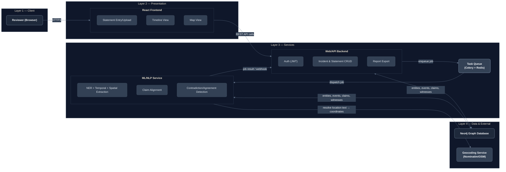

# Architecture & Technical Design Diagrams

This document contains professional, publication-quality architecture diagrams for the system, created in standard **Mermaid Markdown** notation with custom styling. Each diagram accurately implements all layers, components, lifelines, numbered steps, and technology pills.

---

## 1. System Architecture Diagram

A boxes-and-arrows system architecture diagram laid out **left-to-right** across four vertical layers: Client, Presentation, Services, and Data & External. It highlights the decoupling of the **Web/API Backend** and **ML/NLP Service** via an asynchronous **Task Queue (Celery + Redis)** and shared access to the **Neo4j Graph Database**.



### Layer Summary
- **Layer 1 — Client**: Single entry box for `Reviewer (Browser)`.
- **Layer 2 — Presentation**: A composite `React Frontend` box encapsulating `Statement Entry/Upload`, `Timeline View`, and `Map View`. Connected via `HTTPS`.
- **Layer 3 — Services**: Side-by-side decoupled boxes for `Web/API Backend` and `ML/NLP Service` bridged by an asynchronous `Task Queue (Celery + Redis)`.
- **Layer 4 — Data & External**: Persistent graph storage in `Neo4j Graph Database` (read/write from both backend services) and external geospatial resolution via `Geocoding Service (Nominatim/OSM)`.

---

## 2. Workflow / Sequence Diagram

A swimlane sequence diagram illustrating the complete end-to-end lifecycle of a witness statement—from submission and async NLP extraction to contradiction/agreement detection, visualization, and source statement traceability.

```mermaid
%%{
  init: {
    'theme': 'base',
    'themeVariables': {
      'actorBkg': '#1E293B',
      'actorBorder': '#64748B',
      'actorTextColor': '#F8FAFC',
      'actorLineColor': '#64748B',
      'signalColor': '#E2E8F0',
      'signalTextColor': '#F8FAFC',
      'noteBkgColor': '#334155',
      'noteBorderColor': '#475569',
      'noteTextColor': '#E2E8F0'
    }
  }
}%%
sequenceDiagram
    autonumber
    actor Reviewer as Reviewer
    participant Frontend as Frontend
    participant Backend as Web/API Backend
    participant ML as ML/NLP Service
    participant Database as Database

    Reviewer->>Frontend: Submit witness statement
    Frontend->>Backend: POST /incidents/{id}/statements
    Backend->>Database: Store raw statement
    Backend->>ML: Enqueue extraction job (async)
    Backend-->>Frontend: 202 Accepted (job id)
    ML->>ML: Run NER + temporal + spatial + event extraction
    ML->>Database: Write structured claims
    ML->>ML: Align claims across witnesses; detect contradictions/agreements
    ML->>Database: Write contradiction/agreement results with source-span references
    Frontend->>Backend: GET /incidents/{id}/timeline and /map (polling or on job-complete notification)
    Backend->>Database: Read consolidated results
    Backend-->>Frontend: Return timeline + map + flagged items
    Frontend-->>Reviewer: Render timeline, map, and contradiction/agreement markers
    Reviewer->>Frontend: Click a flagged item
    Frontend-->>Reviewer: Show exact source statement text (traceability)
```

### Step-by-Step Execution Reference

| Step # | Caller / Source | Callee / Target | Message / Action | Type |
| :---: | :--- | :--- | :--- | :--- |
| **1** | Reviewer | Frontend | `Submit witness statement` | Solid Request |
| **2** | Frontend | Web/API Backend | `POST /incidents/{id}/statements` | Solid Request |
| **3** | Web/API Backend | Database | `Store raw statement` | Solid Request |
| **4** | Web/API Backend | ML/NLP Service | `Enqueue extraction job (async)` | Solid Request |
| **5** | Web/API Backend | Frontend | `202 Accepted (job id)` | Dashed Response |
| **6** | ML/NLP Service | ML/NLP Service | `Run NER + temporal + spatial + event extraction` | Self-Loop |
| **7** | ML/NLP Service | Database | `Write structured claims` | Solid Request |
| **8** | ML/NLP Service | ML/NLP Service | `Align claims across witnesses; detect contradictions/agreements` | Self-Loop |
| **9** | ML/NLP Service | Database | `Write contradiction/agreement results with source-span references` | Solid Request |
| **10** | Frontend | Web/API Backend | `GET /incidents/{id}/timeline and /map (polling or on job-complete notification)` | Solid Request |
| **11** | Web/API Backend | Database | `Read consolidated results` | Solid Request |
| **12** | Web/API Backend | Frontend | `Return timeline + map + flagged items` | Dashed Response |
| **13** | Frontend | Reviewer | `Render timeline, map, and contradiction/agreement markers` | Dashed Response |
| **14** | Reviewer | Frontend | `Click a flagged item` | Solid Request |
| **15** | Frontend | Reviewer | `Show exact source statement text (traceability)` | Dashed Response |

---

## 3. Technology Stack Diagram

A horizontal layered stack diagram organized top-to-bottom across five functional layers. Each layer is represented as a distinct horizontal band with a subtle color theme containing rounded chips/pills for every technology.

```mermaid
%%{
  init: {
    'theme': 'base',
    'themeVariables': {
      'primaryColor': '#1E293B',
      'primaryTextColor': '#F8FAFC',
      'primaryBorderColor': '#475569',
      'lineColor': '#64748B',
      'fontSize': '14px'
    }
  }
}%%
flowchart TB
    subgraph L1 ["Layer 1 (top) — Presentation"]
        direction LR
        P1("React")
        P2("Tailwind CSS")
        P3("vis-timeline (or D3)")
        P4("Leaflet + OpenStreetMap")
    end

    subgraph L2 ["Layer 2 — API / Backend"]
        direction LR
        B1("FastAPI or Node.js/Express")
        B2("JWT Auth")
        B3("REST API")
    end

    subgraph L3 ["Layer 3 — ML / NLP"]
        direction LR
        M1("spaCy")
        M2("Hugging Face Transformers<br/>(event/relation extraction)")
        M3("sentence-transformers<br/>(semantic similarity)")
        M4("NLI model<br/>(e.g. roberta-large-mnli)")
        M5("dateparser<br/>(temporal normalization)")
        M6("networkx<br/>(graph construction)")
    end

    subgraph L4 ["Layer 4 — Data"]
        direction LR
        D1("Neo4j<br/>(primary graph store)")
        D2("PostgreSQL + PostGIS<br/>(fallback)")
        D3("Redis<br/>(task queue backing store)")
    end

    subgraph L5 ["Layer 5 (bottom) — Infrastructure"]
        direction LR
        I1("Docker Compose")
        I2("GitHub Actions (CI)")
        I3("Nominatim<br/>(geocoding, external)")
    end

    L1 ~~~ L2 ~~~ L3 ~~~ L4 ~~~ L5

    %% Distinct subtle background colors per layer
    style L1 fill:#e0f2fe,stroke:#38bdf8,stroke-width:2px,color:#0369a1
    style L2 fill:#dcfce7,stroke:#4ade80,stroke-width:2px,color:#15803d
    style L3 fill:#f3e8ff,stroke:#c084fc,stroke-width:2px,color:#6b21a8
    style L4 fill:#ffedd5,stroke:#fb923c,stroke-width:2px,color:#c2410c
    style L5 fill:#f1f5f9,stroke:#94a3b8,stroke-width:2px,color:#334155

    %% Rounded pill/chip styles per layer
    classDef pill1 fill:#ffffff,stroke:#0284c7,stroke-width:1.5px,color:#0369a1,rx:20px,ry:20px;
    classDef pill2 fill:#ffffff,stroke:#16a34a,stroke-width:1.5px,color:#15803d,rx:20px,ry:20px;
    classDef pill3 fill:#ffffff,stroke:#7e22ce,stroke-width:1.5px,color:#6b21a8,rx:20px,ry:20px;
    classDef pill4 fill:#ffffff,stroke:#ea580c,stroke-width:1.5px,color:#c2410c,rx:20px,ry:20px;
    classDef pill5 fill:#ffffff,stroke:#475569,stroke-width:1.5px,color:#334155,rx:20px,ry:20px;

    class P1,P2,P3,P4 pill1;
    class B1,B2,B3 pill2;
    class M1,M2,M3,M4,M5,M6 pill3;
    class D1,D2,D3 pill4;
    class I1,I2,I3 pill5;
```



### Layer & Technology Matrix

| Layer Band | Band Background | Technologies (Chips/Pills) |
| :--- | :---: | :--- |
| **Layer 1 — Presentation** | Light Blue (`#e0f2fe`) | • `React`<br>• `Tailwind CSS`<br>• `vis-timeline (or D3)`<br>• `Leaflet + OpenStreetMap` |
| **Layer 2 — API / Backend** | Light Green (`#dcfce7`) | • `FastAPI or Node.js/Express`<br>• `JWT Auth`<br>• `REST API` |
| **Layer 3 — ML / NLP** | Light Purple (`#f3e8ff`) | • `spaCy`<br>• `Hugging Face Transformers (event/relation extraction)`<br>• `sentence-transformers (semantic similarity)`<br>• `NLI model (e.g. roberta-large-mnli)`<br>• `dateparser (temporal normalization)`<br>• `networkx (graph construction)` |
| **Layer 4 — Data** | Light Orange (`#ffedd5`) | • `Neo4j (primary graph store)`<br>• `PostgreSQL + PostGIS (fallback)`<br>• `Redis (task queue backing store)` |
| **Layer 5 — Infrastructure** | Light Gray (`#f1f5f9`) | • `Docker Compose`<br>• `GitHub Actions (CI)`<br>• `Nominatim (geocoding, external)` |
